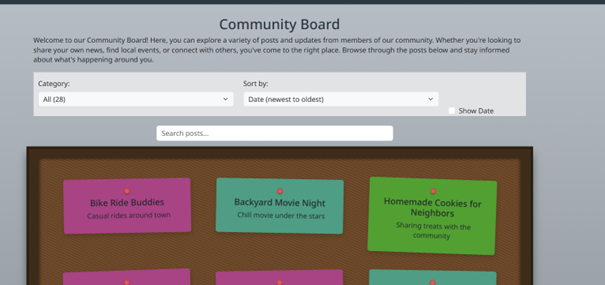
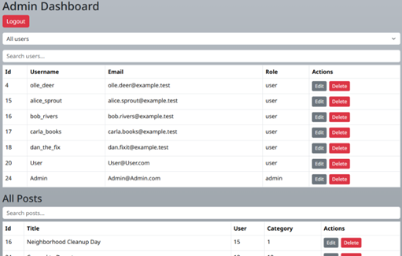
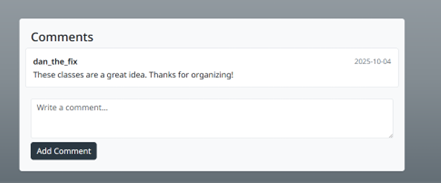
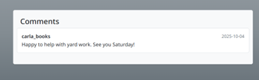
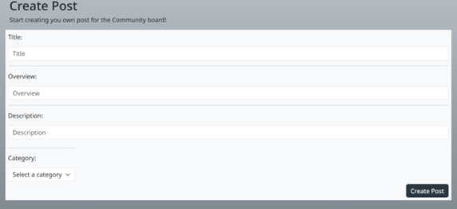
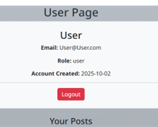

# Community Board

Welcome to Community Board! This is a simple, modern web app where you can share posts, browse what others are saying, and join in on discussions.

Built with React and Bootstrap, it’s fast, clean, and works great on any device. You can create an account, post your thoughts, comment on others, and easily sort posts by title, category, or date to find what interests you.

##  Features
- Clean and responsive layout  
- Sort posts by title, category, or date
- User creation  
- Create and comment on posts
- Powered by React + Bootstrap 

## Installation

1. Clone the repository:
   ```sh
   git clone https://github.com/yourusername/community-board.git
   cd community-board
   ```
2. Install dependencies:
   ```sh
   npm install
   ```
3. Start the development server:
   ```sh
   npm run dev
   
## Usage

- Register a new user or log in.
- Create, view, and sort posts.
- Comment on posts.

## Tech Stack

- React
- TypeScript
- Bootstrap
- Vite
- C# ASP.NET Core
- SQLite

## User Roles & Demo Login

There are two user roles in Community Board:

- **Admin:** Can edit and delete any post, comment, or user.
- **User:** Can create, edit, and delete their own posts and comments.

**Demo accounts for testing:**

- **Admin:**  
  Email: `Admin@Admin.com`  
  Password: `admin`

- **User:**  
  Email: `User@User.com`  
  Password: `user`

## Screenshots

### Front Page


### Admin Dashboard


### Comment Section (Logged In) And Comment Section (Visitor)


### Create Post


### User Page
